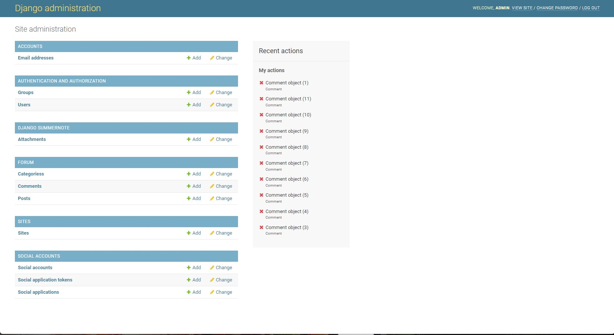

# Growing in harmony

Live App link : [Grow in harmony](https://growingharmoni.herokuapp.com/)
Git Hub Repository : [Grow in harmony](https://github.com/GurraNasan/growing-harmony/)

Grow in harmony is a app for home farmers and plant lovers, it is build on a blog but is meant to be more
interactiv. On the site the user can read and make there own posts and comment on other users posts. You need
to register a user if you want to post/like or comment on a post. But it is also a page for the owner to sell her
merch and sell in the brand.

# Contents

+ [User Experience(UX)](#user-experience-ux)
  + [Agile Method](#agile-method)
      + [User Stories](#user-stories "User Stories")
      + [Data modal](#data-modal)
      + [Future Features](#future-features)
      
+ [Page Features](#page-features)
   + [nav bar](#nav-bar)
   + [Index](#index-page)
   + [Shop](#shop)
   + [Forum](#forum)
      + [Category](#category)
      + [Category Posts](#category-post)
      + [Post](#post)
      + [Add post](#add-post)  
   + [Contact](#contact)
   + [Register](#register)
   + [Admin](#radmin)
   
+ [Technologies](#Technologies)
   + [Programming Languages](#programming-languages)
   + [Support Programs & libraries](#support-programs-libraries)

+ [Testing](#Testing)
    + [Bug](#bugs)
    + [ManuelTesting](#manuel-testing)
    + [NavigationHeader](#navigation-header)
    + [PageManualTesting](#home-page-maual-testing)
    + [Index page](#testing-index-page)
    + [SignInManualTesting](#sign-in-manual-testing)
    + [Forum](#teseting-forum)  
        + [Category Page](#category-page-testing)
        + [Category Posts](#category-post-testing)
        + [Posts](#post-testing)
        + [add/edit post](#add/edit-post)          
    + [Validation](#Validation)
        + [HTML](#html)
        + [CSS](#css)
        + [Python](#python)
        + [Javascrip](#javascript)
        + [Lighthouse](#lighthouse)
   
+ [Deployment](#deployment)
   + [Github](#github)
   + [Gitpod and Django](#gitpod-and-django)
   + [Heroku](#heroku)   
   
+ [Acknowledgments](#acknowledgments)
    + [Credits](#credits)
    + [Copied Code](#copied-code)
    
## User Experience UX

I found a good bootstrap template from [Bootstrapmade](https://bootstrapmade.com/) called PhotoFolio. I liked the green colors because
i was making a plant forum and fellt like it was a great fit. It had a nice nav menu that worked good both on computer and on a phone. 

### Agile Method

I used the github projects as a agile tool to manage the planning and implamentation of functions to the site. 
[Project Board](https://github.com/users/GurraNasan/projects/5)

### User Stories

Before i started to write the code a made user stories to for what the user/admin wanted and what they would get from it. 
This are my user stories:
+ [USER STORY: Account registrator](https://github.com/GurraNasan/growing-harmony/issues/1)
+ [USER STORY: Admin](https://github.com/GurraNasan/growing-harmony/issues/8)
+ [USER STORY: Add post](https://github.com/GurraNasan/growing-harmony/issues/3)
+ [USER STORY: Comment on post](https://github.com/GurraNasan/growing-harmony/issues/4)
+ [USER STORY: Like/unlike](https://github.com/GurraNasan/growing-harmony/issues/2)
+ [USER STORY: View post](https://github.com/GurraNasan/growing-harmony/issues/7)
+ [USER STORY: Add category](https://github.com/GurraNasan/growing-harmony/issues/9)
+ [USER STORY: View like](https://github.com/GurraNasan/growing-harmony/issues/5)
+ [USER STORY: View shop](https://github.com/GurraNasan/growing-harmony/issues/6)

### Data Modal
Before a started i made a model diagram so i would know how to build up the databasa modal and
connect them toghter.

### Future Features
When i was coding i came up with a couple of more features to implant.
User can delete and edit comments, i have the knowledgs to do it, but felt i did not have time
A online shop for merch, i dont have the knowledge yet to do it.
A better design for the post when you choosed a category, with more information.

## Page Features

### Nav bar

Here you can see the name of the page and links to all pages, this is for big screens.
There is also social links to Instagram and Facebook

The nav bar is responsiv and on smaller screens it turns in to a list

### Index page

Here you can read a short presentation about the page owner and what the page is about

### Shop

Here you can see on a google linked map were you can by the page owners merch

### Forum
#### Category

Here the user can see the categories the page owner/admin choosed to make and can press on them if they want to read or add a post in that category. 

#### Category post

Here the user can see all the posts in that category and see how many likes they have got. 
If the user is logged in he/she gets a button to add post in that category. The user can press the
post and see it in whole. I feel that there is alot with the design to fix here but that will be in next circle.
      
#### Post

 
Here the user can read the whole post with title, content and image if there are any. If there is the author of the post he/she gets a edit and a delete button so the user can interakt with it. 

 
Here the user can read comments on the post and if they are logged in they can leave there own.

#### Add post

 
Here the user get a Field to type title, a field for content and can uploade a image if he/she want. The edit page looks the same. 

### Contact

 
Here the user get the email adress and real adress to the site owner 

### Register

Here a user can sign up to the site so he/she can comment and post in the forum.

If the user already have a account on the page.

If the user want to sign out

### Admin

 
Here the site owner got there own page to controll the page. He/she can add/delete/edit categorys, posts and comments. 

## Technologies

### Programming Languages
+ [HTML5](https://en.wikipedia.org/wiki/HTML5)
+ [CSS3](https://en.wikipedia.org/wiki/Cascading_Style_Sheets)
+ [Javascript](https://en.wikipedia.org/wiki/JavaScript)
+ [Python](https://www.python.org/)

### Support Programs & libraries

+ [Git](https://git-scm.com/)
    - Version control.
+ [GitHub](https://github.com/)
    - For storing code and deploying the site.
+ [Gitpod](https://www.gitpod.io/)
    - Used for building and editing my code.
+ [Django](https://www.djangoproject.com/)
    - A python based framework that was used to develop the site.
+ [Bootstrap](https://getbootstrap.com/)
    - For help designing the html templates.
+ [Google Fonts](https://fonts.google.com/)
    - Used to add style the website's font.
+ [Font Awesome](https://fontawesome.com/)
    - Used to obtain the icons used.
+ [Favicon.io](https://favicon.io/emoji-favicons/amphora/)
    - Used to generate the site's favicon.   
+ [Google Developer Tools](https://developers.google.com/web/tools/chrome-devtools)
    - Used to help fix problem areas and identify bugs.
+ [Cloudinary](https://cloudinary.com/)
    - Used to store static files and images.
+ [ElephantSQL](https://www.elephantsql.com/)
    - Storage for the database
+ [W3C Markup Validation Service](https://validator.w3.org/) 
    - Used to validate HTML code.
+ [W3C CSS Validation Service](https://jigsaw.w3.org/css-validator/#validate_by_input)
    - Used to validate CSS code.
+ [Pep8ci](https://pep8ci.herokuapp.com/) - Thank you Code Institute
    - Used to validate Python code found on slack #announcements
+ [JSHint](https://jshint.com/)
    - Used to validate JS code.
+ [Summernote](https://summernote.org/)
+ [Heroku](https://www.heroku.com/)
    - To deploy the project.
   
   
## Testing

### Bug
I have run in to a couple of bug while you writing the code and i tried to squash them direct when i run in to them. So i forgot to document them. 

But the biggest one was that my css was gone when first deployed the page, to see if it worked

This was fixed by setting debug to False.

Many bugs was just typos like. 

I wrote block insteat of base. 

I had but a big C in the post wiew instead of a small one. 

Here i forgot the  in the template

One big bug i needed to ask slack about help was that i could not get the image in the post to update
when the user edit there post. I got it fixed by putting, request.FILES in the view for EditPost when i requested the post form. An importen thing when dealing with images in forms was to enctype="multipart/form-data" in the form tag. 

### ManuelTesting
When i put in a new featured i manuel testet it to see if it worked as i expected. 

#### NavigationHeader testing
For the nav bar i tested so the nav links send me to the right site by press on them.
The social links opens in a new tab. 
Press the logo and you will be send to the index page. 
If you go to a smaller screen the nav bar change to a list instead, tried it with the devtool in Chrome

If you are logged in you see a log out link

IF you not logged in you get a log in and register link instead

#### Index page testing
Here was not much to try. But the contact link takes you to the contact page.
The text is responsiv and change its layout after the screen size, testet it with devtools 

#### Sign In Manual Testing

I tried the sign in page by write in short password and no username and i gave me errors 

#### Forum testing

This is the page were the most backend can go wrong and most thing to test. 

##### Category Page testing

Here i tested it out by pressing the category card and they take you to the right category. 
The page is responsiv and on big screen it shows up to 3 categorys in a row.
On smaller screens the categorys jumps down under each other. Tried it out with devtool

##### Category Posts testing

Here should the right post that is connected to the category only be showing and it seems to do that.
It also shows how many likes the posts have got, and tried to like and unlike the posts and the count changed

If you logged in you can add post

If you not logged in you cant see the add post button

##### Posts testing

Here the user can read the post, see the title and the image that is uploaded in the post and everything renders as it should. 

If the logged in user is the author of the post he/she can see a edit/delete button. They cant be seen if you are not logged in or the wrong user.
Tried to long in as other user and cant see them. 

##### add/edit post
I tried to post and it workes fine and the post shows up as they should, i tried to edit them too and it works.

Tried what happens if you have no title in the post or change to a title that already exists

### Validation

#### HTML

No errors

#### CSS

Here i got some errors that lays in the css from the Bootstrapmade css template.
tried to fix it, but my knowledgs in css is not that good yet.

#### Python

No error in the python code

### Javascript

No errors in the javescript

### Lighthouse

## Deployment
I used github and heroku to deply this project

### Github

+ First you need to start a new repository.
+ Logg in to Github.
+ Press the blue book icon.
+ Choose a template, i use the code institute template as recommended.
+ Add repository name and press create repository in the bottom of the page.
+ Then press the gitpod button.

### Gitpod and Django

+ Here you install django with pip install Django
+ Install other Libraries you need
+ Write your code
+ Dont forget to make a env file for sensitiv data and write it in the .gitignore file so you dont send it to the public. 
+ You also need to make a requirements.txt file. Use: pip3 -freeze-- local > requirements.txt
+ Make a Procfil

### Heroku

+ Logg in to heroku
+ Press the new button and then new app
+ Choose uniquely app name and region and click creat app
+ Go to settings and reveal config var, here you write in all the sensetiv data, address to database and other urls you use in the project.
+ Go back at the top and click on "Deploy" and select "GitHub".
+ Scroll down and click on 'Connect to GitHub'.
+ Search for your GitHub repository name by typing it.
+ Click on "Connect".
+ Scroll down and click on "Deploy Branch".
+ You will see a message "The app was successfully deployed" when the app is built with python and all the depencencies.
+ Click on view and you will see the [deployed site](https://growingharmoni.herokuapp.com/).

## Acknowledgments
### Credits
To fellow students on Slack for inspiration and help when i was stuck 
Code Institute Tutoring for when the panic set in
Code Institute lesson videos, many hourse going back and forward, so not it almost feels like i know Matt personally.
Bootstrapmade for they template i used to design the app

### Copied Code
Code Institutes walkthrough: I think therefore I Blog paid a big part in the structure of my App as well as certain parts that are directly used and referred to in the code via comments. And i used some of the code from the bootstrap resume lessons, like the google map api. 

[Back to top ⇧](#contents)
